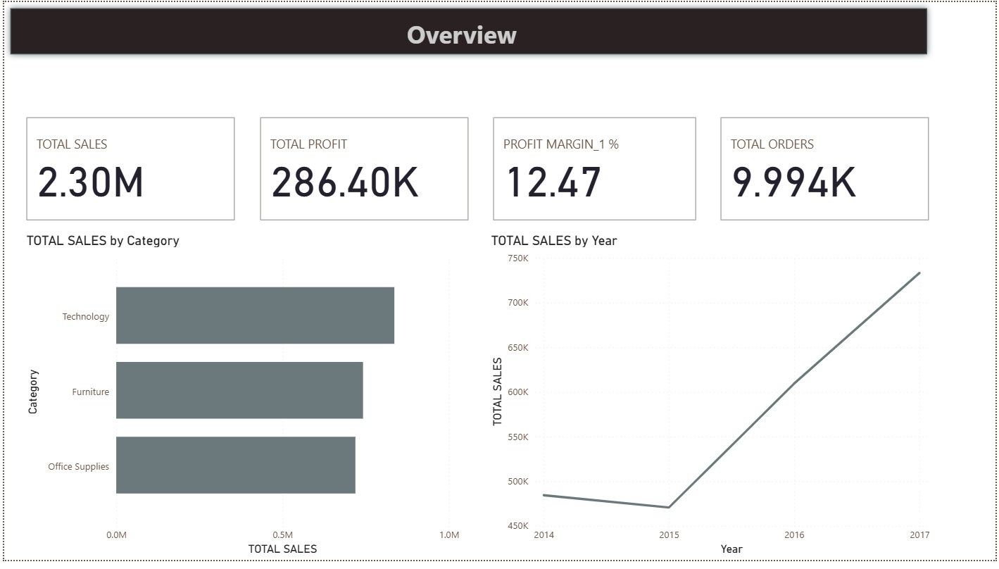

# Superstore Sales Dashboard (Power BI)

An interactive 5-page Power BI report analysing sales, profit, orders and customer behaviour using the Sample Superstore dataset (9,994 order lines, 2014-2017).

## Key Figures

| Metric | Value |
|---|---|
| Total Sales | 2.30M |
| Total Profit | 286.4K |
| Profit Margin | 12.47% |
| Order Lines | 9,994 |

## Report Pages

1. **Executive Summary**: KPI cards (Growth %, Total Sales, Profit Margin, Orders), sales by category and by year, sales vs target, slicers for Category and Region.
2. **Customer & Geography**: top customers by number of orders, profit by state, monthly sales by sub-category (matrix), gauges showing East region and Consumer segment share of total sales.
3. **Sales Analysis**: orders by product and ship mode, discount by category, sales by segment, sales trend by year, regional summary table.
4. **Overview**: headline KPIs with sales by category and yearly sales trend.
5. **Profit Decomposition**: decomposition tree (Ship Mode > Region > City) to find what drives profit.

## Insights

- West is the top region by sales (725K) with the highest margin (14.94%); Central has the lowest margin (7.92%).
- Standard Class accounts for the largest share of profit (164K of 286K).
- California and New York lead profit by state.
- Consumer is the largest customer segment by sales.
- Office Supplies receive the highest total discount.

## DAX Measures Used

- Total Sales, Total Profit, Profit Margin %
- Sales Last Year (`SAMEPERIODLASTYEAR`)
- Growth % (year-over-year)
- Sales YTD / QTD / MTD (time intelligence)
- Segment and region filtered measures (`CALCULATE`)

## Skills Demonstrated

Data modelling (date table), DAX time intelligence, KPI design, drill-down analysis, slicers and interactive filtering, consistent report theming.

## Tools

Power BI Desktop, DAX

## Screenshots

## Files

- `SALES_REPORT.pbix`: Power BI report
- `Screenshots/`: report page images

## Author

Md. Mushfiqur Rahman
[LinkedIn](https://linkedin.com/in/mushfiqur-rahman-960697280)
